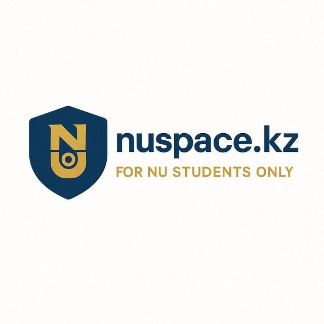

# Nuspace.kz



**Nuspace.kz** is a secure platform for Nazarbayev University students, accessible via `@nu.edu.kz` email verification. It restricts access to verified users, reducing fraud risk, and offers a set of services that streamline and centralize student communication—replacing unstructured Telegram chats with a more reliable and organized solution.

## Table of Contents

- [Nuspace.kz](#nuspacekz)
  - [Table of Contents](#table-of-contents)
  - [Features](#features)
  - [Tech Stack](#tech-stack)
  - [Prerequisites](#prerequisites)
  - [Setup Instructions](#setup-instructions)
    - [1. Clone the Repository](#1-clone-the-repository)
    - [2. Configure Environment Variables](#2-configure-environment-variables)
    - [3. Install Pre-commit Hooks](#3-install-pre-commit-hooks)
    - [4. Build and Run with Docker](#4-build-and-run-with-docker)
    - [5. Verify Setup](#5-verify-setup)
    - [6. Telegram Bot Localization binary compilation](#6-telegram-bot-localization-binary-compilation)
  - [Current Functionality and Roadmap](#current-functionality-and-roadmap)
  - [Development Guidelines](#development-guidelines)
  - [License](#license)
  - [Contributing](#contributing)
  - [Contact](#contact)

## Features

- Private and secure access for Nazarbayev University students.
- Centralized services to replace unstructured Telegram chats.
- Reliable and efficient communication platform.

## Tech Stack

**Nuspace.kz** is built with following technology stack:

**Backend:**

- **Framework:** FastAPI (Python)
- **Asynchronous Task Processing:** Celery
- **Database:** PostgreSQL
- **Caching:** Redis
- **Message Broker:** RabbitMQ
- **Search Engine:** Meilisearch

**Frontend:**

- **Language:** TypeScript
- **Framework/Library:** React
- **Build Tool:** Vite
- **Styling:** Tailwind CSS

**DevOps & Infrastructure:**

- **Containerization:** Docker, Docker Compose
- **Web Server/Reverse Proxy:** Nginx
- **Tunneling:** Cloudflare Tunnel (Cloudflared)
- **Version Control:** Git & GitHub
- **CI/CD & Automation:** Pre-commit hooks, GitHub Actions
- **Database Management:** PgAdmin

## Prerequisites

To set up the project, ensure you have the following installed:

- [Docker](https://www.docker.com/)
- Pre-commit
- Google Cloud credentials (bucket name, project ID, topic, and `nuspace.json` file for bucket access).
- Keycloak credentials for Google Identity Provider (IDP).

## Setup Instructions

### 1. Clone the Repository

```bash
git clone https://github.com/your-username/nuspace.git
cd nuspace
```

### 2. Configure Environment Variables

Create a `.env` file in the root directory and specify the required environment variables. Use the `.env.example` file as a reference:

```bash
cp .env.example .env
```

Update the `.env` file with:

- Google Cloud bucket name, project ID, topic.
- Add `nuspace.json` under backend/core/configs/ directory. It is a service account credentials that has bucket access. Obtain it from [Google Cloud Console](https://console.cloud.google.com)
- Keycloak credentials for Google IDP. You need to setup both Keycloak server and Google OAuth 2.0
- Cloudflare Tunnel credentials. Go to [Zero Trust](https://one.dash.cloudflare.com/) to get these tunnels
- Other variables such as database connections backend service configurations

### 3. Install Pre-commit Hooks

Install `pre-commit` and set up Git hooks:

```bash
pip install pre-commit
pre-commit install
```

### 4. Build and Run with Docker

Build and start the project using Docker:

```bash
docker-compose up --build
```

### 5. Verify Setup

Ensure the application is running by accessing the appropriate URL (e.g., [localhost](http://localhost)).

### 6. Telegram Bot Localization binary compilation

```bash
msgfmt backend/routes/bot/locales/ru/LC_MESSAGES/messages.po -o backend/routes/bot/locales/ru/LC_MESSAGES/messages.mo
msgfmt backend/routes/bot/locales/en/LC_MESSAGES/messages.po -o backend/routes/bot/locales/en/LC_MESSAGES/messages.mo
msgfmt backend/routes/bot/locales/kz/LC_MESSAGES/messages.po -o backend/routes/bot/locales/kz/LC_MESSAGES/messages.mo
```

## Current Functionality and Roadmap

**Current Features:**

- **Kupi Prodai:** A marketplace service exclusively for NU students to buy and sell items. This ensures a trusted environment for transactions within the university community.

**Roadmap/Upcoming Features:**

- **Campus Current:** A dedicated section for information about holidays, meetings, and events happening on the University campus. Students will be able to discover activities and events that align with their interests, fostering a more connected campus life.
- **Dorm Eats:** Daily menu in the university canteen. What dishes are available, what dishes are being prepared - all this students have the opportunity to find out in advance.

## Development Guidelines

- Always use `pre-commit` to ensure code quality.
- Follow the contribution guidelines for submitting pull requests.

## License

This project is licensed under the MIT License. See the [LICENSE](LICENSE) file for details.

## Contributing

We welcome contributions! Please read the [CONTRIBUTING.md](CONTRIBUTING.md) file for guidelines.

## Contact

For any questions or support, please contact the maintainers at [ulan.sharipov@nu.edu.kz](mailto:ulan.sharipov@nu.edu.kz) or [telegram](https://t.me/kamikadze24).
