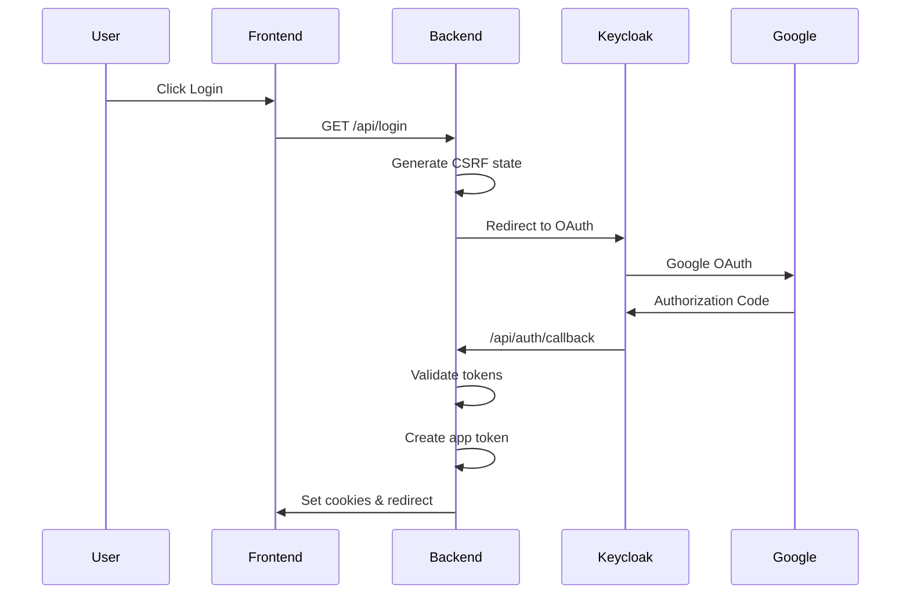
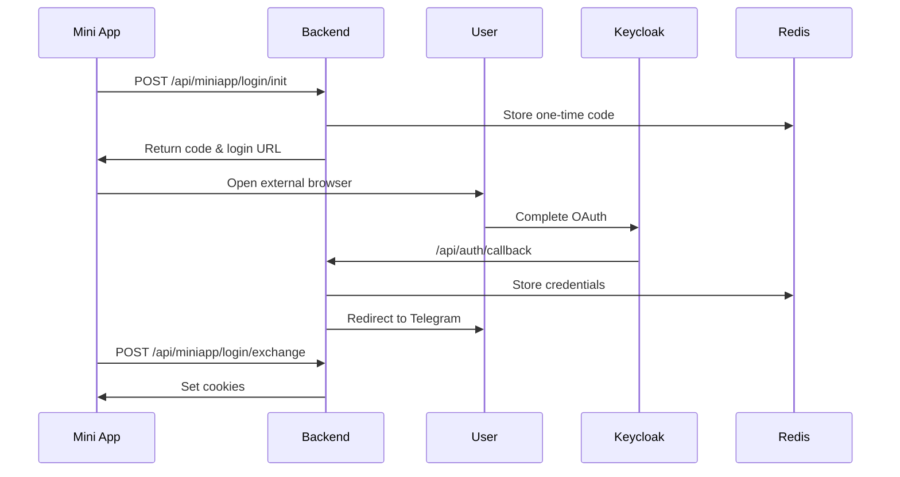
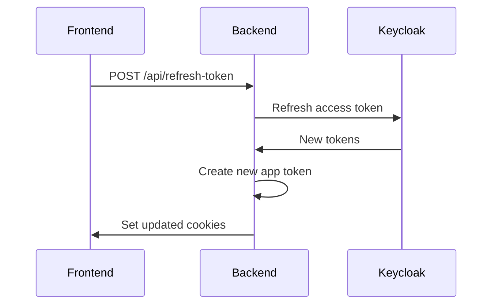

# Authentication System Documentation

This document provides a comprehensive overview of the authentication system implemented in the Nuros backend, covering all authentication flows, components, and security considerations.

## Table of Contents

1. [Overview](#overview)
2. [Architecture Components](#architecture-components)
3. [Authentication Flows](#authentication-flows)
4. [Security Features](#security-features)
5. [API Endpoints](#api-endpoints)
6. [Configuration](#configuration)
7. [Development & Testing](#development--testing)

## Overview

The authentication system is built around **Keycloak** as the primary Identity Provider (IdP) with **Google OAuth** integration. The system supports multiple authentication flows:

- **Web Browser Flow**: Traditional OAuth2 authorization code flow
- **Telegram Mini App Flow**: Specialized flow for Telegram Mini Apps
- **Mock Authentication**: Development-only bypass for testing

The system uses a **dual-token approach**:
- **Keycloak Tokens**: External identity management (access_token, refresh_token, id_token)
- **Application Tokens**: Internal application-specific permissions and roles

## Architecture Components

### 1. KeyCloakManager (`keycloak_manager.py`)
Handles all Keycloak-related operations:
- OAuth2 client configuration
- Token validation and refresh
- JWT signature verification using JWKS
- User session management

**Key Features:**
- Automatic JWKS caching (1-hour TTL)
- Token refresh capabilities
- Mock mode support for development

### 2. AppTokenManager (`app_token.py`)
Manages application-specific JWT tokens:
- Creates tokens with user roles and permissions
- Validates application tokens
- Handles community-based access control

**Token Claims:**
```json
{
  "sub": "user_subject_id",
  "role": "user_role",
  "communities": ["community_ids"],
  "exp": "expiration_timestamp",
  "tg_id": "telegram_id"
}
```

### 3. Authentication Router (`auth.py`)
Main authentication endpoint handler with the following flows:

#### Web Browser Flow
1. User visits `/api/login`
2. Redirected to Keycloak/Google OAuth
3. Returns to `/api/auth/callback`
4. Validates tokens and sets cookies
5. Redirects to home page

#### Telegram Mini App Flow
1. Mini App calls `/api/miniapp/login/init`
2. Returns one-time code and external login URL
3. User completes OAuth in system browser
4. Mini App calls `/api/miniapp/login/exchange`
5. Sets cookies in Mini App context

## Authentication Flows

### Web Browser Authentication



**Security Features:**
- CSRF protection with Redis-stored state
- Token validation using JWKS
- Secure cookie configuration

### Telegram Mini App Authentication



**Security Features:**
- One-time codes with 5-minute TTL
- Credential storage in Redis with expiration
- Automatic cleanup after exchange

### Token Refresh Flow



## Security Features

### 1. CSRF Protection
- State parameter validation for web flows
- Redis-stored state with 10-minute expiration
- Automatic cleanup after use

### 2. Token Security
- **Keycloak Tokens**: Validated using JWKS
- **App Tokens**: HMAC-SHA256 signed
- **Refresh Tokens**: Stored in secure HTTP-only cookies
- **Access Tokens**: Short-lived (typically 15 minutes)

### 3. Cookie Security
```python
# Secure cookie configuration
httponly=True,           # Prevent XSS
secure=not config.IS_DEBUG,  # HTTPS only in production
samesite="Lax",          # CSRF protection
max_age=token_expiry     # Automatic expiration
```

### 4. Rate Limiting & Validation
- Input validation on all endpoints
- Proper error handling without information leakage
- Logging for security events

## API Endpoints

### Authentication Endpoints

| Endpoint | Method | Description | Flow |
|----------|--------|-------------|------|
| `/api/login` | GET | Initiate login | Web |
| `/api/auth/callback` | GET | OAuth callback | Web |
| `/api/miniapp/login/init` | GET | Mini App login init | Mini App |
| `/api/miniapp/login/exchange` | POST | Mini App token exchange | Mini App |
| `/api/refresh-token` | POST | Refresh tokens | Both |
| `/api/me` | GET | Get current user | Both |
| `/api/logout` | GET | Logout user | Both |
| `/api/connect-tg` | POST | Bind Telegram account | Both |

### User Management Endpoints

| Endpoint | Method | Description |
|----------|--------|-------------|
| `/api/me` | GET | Get current user profile |
| `/api/connect-tg` | POST | Generate Telegram binding link |

## Configuration

### Environment Variables

```bash
# Keycloak Configuration
KEYCLOAK_URL=https://your-keycloak-instance.com
REALM=your-realm
KEYCLOAK_CLIENT_ID=your-client-id
KEYCLOAK_CLIENT_SECRET=your-client-secret

# Application Configuration
APP_JWT_SECRET_256=your-256-bit-secret
APP_TOKEN_EXPIRY_MINUTES=14
COOKIE_APP_NAME=app_token
COOKIE_REFRESH_NAME=refresh_token

# Development
MOCK_KEYCLOAK=false
IS_DEBUG=true
```

### Redis Configuration
- Used for CSRF state storage
- Mini App credential caching
- TTL-based automatic cleanup

## Development & Testing

### Mock Authentication
For development, the system supports mock authentication:

```python
# Enable mock mode
MOCK_KEYCLOAK=true

# Use mock user
/api/login?mock_user=1
```

**Mock Features:**
- Bypasses Keycloak entirely
- Pre-generated test credentials
- Same token validation flow
- Development-only feature

### Testing Considerations

1. **Token Validation**: All tokens are validated on each request
2. **Session Management**: Proper cleanup of expired sessions
3. **Error Handling**: Graceful handling of invalid tokens
4. **Security Headers**: Proper CORS and security headers

### Common Issues & Solutions

1. **Token Expiration**: Automatic refresh via `/api/refresh-token`
2. **CSRF Errors**: Ensure state parameter is properly handled
3. **Mini App Issues**: Check Redis connectivity and TTL settings
4. **Cookie Issues**: Verify secure/httponly settings match environment

## Security Best Practices

1. **Never store sensitive data in client-side storage**
2. **Always validate tokens on protected endpoints**
3. **Use HTTPS in production**
4. **Implement proper session timeout**
5. **Monitor for suspicious authentication patterns**
6. **Regular security audits of token configurations**

## Integration Examples

### Frontend Integration (Web)
```javascript
// Redirect to login
window.location.href = '/api/login?return_to=' + encodeURIComponent(window.location.pathname);

// Check authentication status
const response = await fetch('/api/me');
if (response.ok) {
    const user = await response.json();
    // Handle authenticated user
}
```

### Frontend Integration (Mini App)
```javascript
// Initialize Mini App login
const initResponse = await fetch('/api/miniapp/login/init');
const { code, login_url } = await initResponse.json();

// Open external browser for OAuth
window.open(login_url, '_blank');

// Exchange code for cookies
const exchangeResponse = await fetch('/api/miniapp/login/exchange', {
    method: 'POST',
    headers: { 'Content-Type': 'application/json' },
    body: JSON.stringify({ code })
});
```

This authentication system provides a robust, secure foundation for user authentication across multiple platforms while maintaining flexibility for different use cases and development scenarios.
