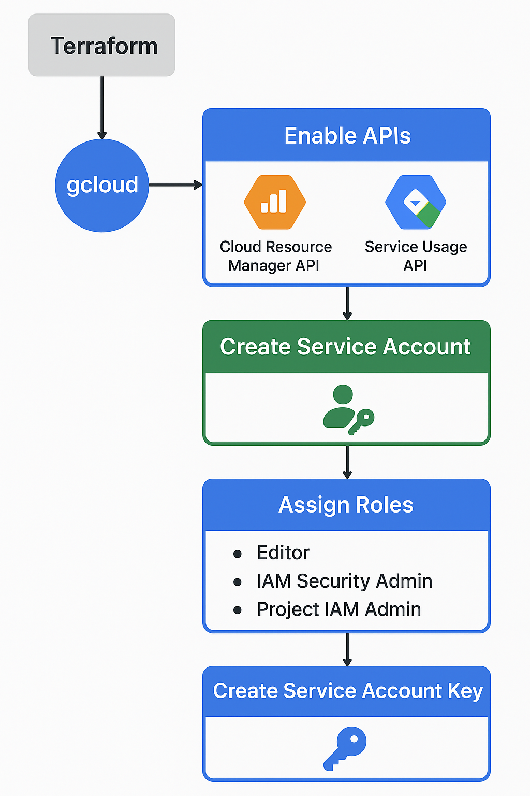

# Nuspace Infrastructure with Terraform

<div align="center">
  
</div>

## 📖 Table of Contents

- **[Quick Start - Daily Usage](#quick-start---daily-usage)** ← Most users start here
- [Configuration Structure](#configuration-structure)
- [Remote State Backend](#remote-state-backend)
- **[Initial Setup from Scratch](#initial-setup-from-scratch)** ← For replicating the entire infrastructure
- [Troubleshooting](#troubleshooting)
- [Security Notes](#security-notes)

---

## Quick Start - Daily Usage

**⚠️ Prerequisites:** You need `gcloud` CLI authenticated and Terraform installed.

### First Time Setup on Your Machine

```bash
cd terraform

# Initialize Terraform with remote backend
terraform init -backend-config=backend.tfbackend
```

### Working with Staging

```bash
# Switch to staging workspace
terraform workspace select default

# Review planned changes
terraform plan -var-file=envs/staging.tfvars

# Apply changes
terraform apply -var-file=envs/staging.tfvars
```

### Working with Production

```bash
# Switch to production workspace
terraform workspace select production

# Review planned changes
terraform plan -var-file=envs/production.tfvars

# Apply changes
terraform apply -var-file=envs/production.tfvars
```

### Check Current Workspace

Always verify your workspace before applying changes:
```bash
terraform workspace show
```

---

## Configuration Structure

The Terraform configuration is organized into separate files:

- **`providers.tf`**: Google Cloud provider configuration
- **`backend.tf`**: Remote state backend configuration (GCS)
- **`apis.tf`**: Google Cloud API enablements
- **`iam.tf`**: IAM resources (service accounts, roles, WIF)
- **`compute.tf`**: Compute Engine resources (VM, disk, static IP)
- **`storage.tf`**: Cloud Storage buckets (media, logs)
- **`pubsub.tf`**: Pub/Sub resources (topic, subscriptions)
- **`outputs.tf`**: Output values
- **`variables.tf`**: Input variable definitions
- **`backend.tfbackend`**: Backend configuration (gitignored)
- **`envs/`**: Environment-specific variable files
  - `staging.tfvars`: Staging environment configuration
  - `production.tfvars`: Production environment configuration
- **`creds/`**: Service account JSON keys (gitignored)
  - `staging.json`: Terraform admin credentials for staging
  - `production.json`: Terraform admin credentials for production

---

## Remote State Backend

Terraform state is stored remotely in Google Cloud Storage for:
- ✅ Team collaboration
- ✅ State locking (prevents concurrent modifications)
- ✅ Version history (can recover previous states)
- ✅ Protection from local file loss

### Architecture

- **Bucket**: `gs://nuspace-terraform-state/` (in `nuspace-staging` project)
- **Workspaces**:
  - `default` → Staging (`infra/default.tfstate`)
  - `production` → Production (`infra/production.tfstate`)

### Workspace Commands

```bash
# List all workspaces
terraform workspace list

# Show current workspace
terraform workspace show

# Switch workspace
terraform workspace select <workspace-name>

# Create new workspace
terraform workspace new <workspace-name>
```

### VM Service Account

The configuration creates a dedicated service account (`nuspace-vm-sa`) attached to the VM instance, providing:
- Automatic authentication to Google Cloud services (via metadata server)
- Full CRUD operations on media buckets
- CORS policy management
- Pub/Sub access for GCS notifications

---

## Initial Setup from Scratch

**⚠️ This section is for replicating the entire infrastructure setup. If you're joining an existing project, use [Quick Start](#quick-start---daily-usage) instead.**

<div align="center">
  
</div>

### 1. Install Google Cloud CLI

<div align="center">
  
</div>

**For Linux:**
```bash
curl https://sdk.cloud.google.com | bash
```

**For macOS:**
```bash
brew install --cask google-cloud-sdk
```

**For Windows:**
Download from [official Google Cloud SDK page](https://cloud.google.com/sdk/docs/install).

**Initialize and authenticate:**
```bash
gcloud init
```

### 2. Create GCP Project

```bash
gcloud projects create nuspace-staging --name="Nuspace Staging"
```

### 3. Bootstrap Terraform APIs

Terraform needs certain APIs enabled before it can manage other APIs. Enable these manually:

```bash
gcloud services enable \
  cloudresourcemanager.googleapis.com \
  serviceusage.googleapis.com \
  --project=nuspace-staging
```

> **Note:** This is a one-time step per project. After this, Terraform manages all other APIs.

### 4. Create Terraform Service Account

Create a service account for Terraform to use:

```bash
gcloud iam service-accounts create terraform-admin \
    --description="Service account for managing infra" \
    --display-name="Terraform Admin" \
    --project=nuspace-staging
```

Assign necessary IAM roles:

```bash
# Editor role - general resource management
gcloud projects add-iam-policy-binding nuspace-staging \
    --member="serviceAccount:terraform-admin@nuspace-staging.iam.gserviceaccount.com" \
    --role="roles/editor"

# IAM Security Admin - manage service accounts
gcloud projects add-iam-policy-binding nuspace-staging \
    --member="serviceAccount:terraform-admin@nuspace-staging.iam.gserviceaccount.com" \
    --role="roles/iam.securityAdmin"

# Project IAM Admin - manage project IAM policies
gcloud projects add-iam-policy-binding nuspace-staging \
    --member="serviceAccount:terraform-admin@nuspace-staging.iam.gserviceaccount.com" \
    --role="roles/resourcemanager.projectIamAdmin"

# Workload Identity Pool Admin - for GitHub Actions WIF
gcloud projects add-iam-policy-binding nuspace-staging \
    --member="serviceAccount:terraform-admin@nuspace-staging.iam.gserviceaccount.com" \
    --role="roles/iam.workloadIdentityPoolAdmin"
```

Create and download service account key:

```bash
gcloud iam service-accounts keys create ./creds/staging.json \
    --iam-account="terraform-admin@nuspace-staging.iam.gserviceaccount.com"
```

**⚠️ Keep this file secure! Never commit to version control.**

### 5. Create Remote State Bucket

```bash
# Create bucket
gsutil mb -l europe-central2 gs://nuspace-terraform-state

# Enable versioning
gsutil versioning set on gs://nuspace-terraform-state
```


### 7. Initialize Terraform

<div align="center">
  
</div>

```bash
# Initialize with remote backend
terraform init -backend-config=backend.tfbackend

# Create production workspace
terraform workspace new production

# Switch back to default (staging)
terraform workspace select default
```

### 8. Deploy Infrastructure

**For Staging:**
```bash
terraform plan -var-file=envs/staging.tfvars
terraform apply -var-file=envs/staging.tfvars
```

**For Production:**
```bash
terraform workspace select production
terraform plan -var-file=envs/production.tfvars
terraform apply -var-file=envs/production.tfvars
```

### 9. Repeat for Production Project

Follow steps 2-8 for `nuspace2025` (production project), using `envs/production.tfvars` and `creds/production.json`.

---

## Troubleshooting

### Backend Initialization Issues

If you see backend-related errors:
```bash
terraform init -reconfigure -backend-config=backend.tfbackend
```

### Workspace Not Found

Create the missing workspace:
```bash
terraform workspace new production
```

### State Lock Issues

If state is locked from an interrupted operation:
```bash
terraform force-unlock <LOCK_ID>
```

Replace `<LOCK_ID>` with the ID shown in the error message.

### Verify Remote State

Check that state files exist in GCS:
```bash
gsutil ls gs://nuspace-terraform-state/infra/
```

Expected output:
```
gs://nuspace-terraform-state/infra/default.tfstate
gs://nuspace-terraform-state/infra/production.tfstate
```

### View State Versions

Since versioning is enabled:
```bash
gsutil ls -a gs://nuspace-terraform-state/infra/default.tfstate
```

### Wrong Workspace

If you accidentally apply to the wrong environment:
1. **Don't panic** - state is versioned
2. Check workspace: `terraform workspace show`
3. Switch workspace: `terraform workspace select <correct-workspace>`
4. Review state versions if needed

---

## Security Notes

### Credentials Management
- **Service account keys** (`staging.json`/`production.json`) are in `creds/` directory
- **NEVER commit** credential files to version control
- Regularly rotate service account keys
- Consider using Workload Identity Federation for CI/CD (no keys needed)

### Backend Configuration
- `backend.tfbackend` is gitignored (contains credential paths)

### Remote State Security
- State bucket `nuspace-terraform-state` has:
  - ✅ Uniform bucket-level access
  - ✅ Public access prevention enforced
  - ✅ Versioning enabled (can recover previous states)
- State files may contain sensitive data (IPs, secrets, etc.)
- Only authorized service accounts have access

### IAM Best Practices
- Follow principle of least privilege
- Review IAM bindings regularly
- Audit service account usage
- Enable logging for service account key creation/deletion

---

## Additional Resources

- [Terraform GCP Provider Documentation](https://registry.terraform.io/providers/hashicorp/google/latest/docs)
- [Workload Identity Federation Setup](../docs/wif-setup.md)
- [GCS Backend Configuration](https://developer.hashicorp.com/terraform/language/settings/backends/gcs)
